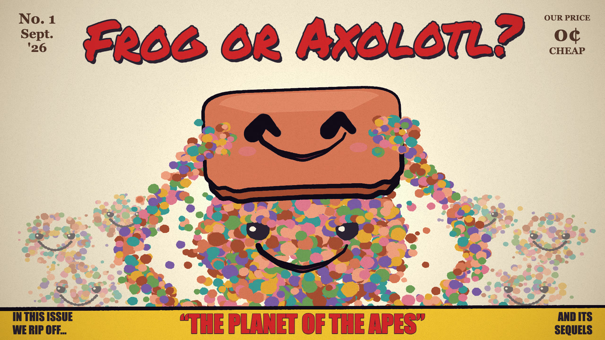
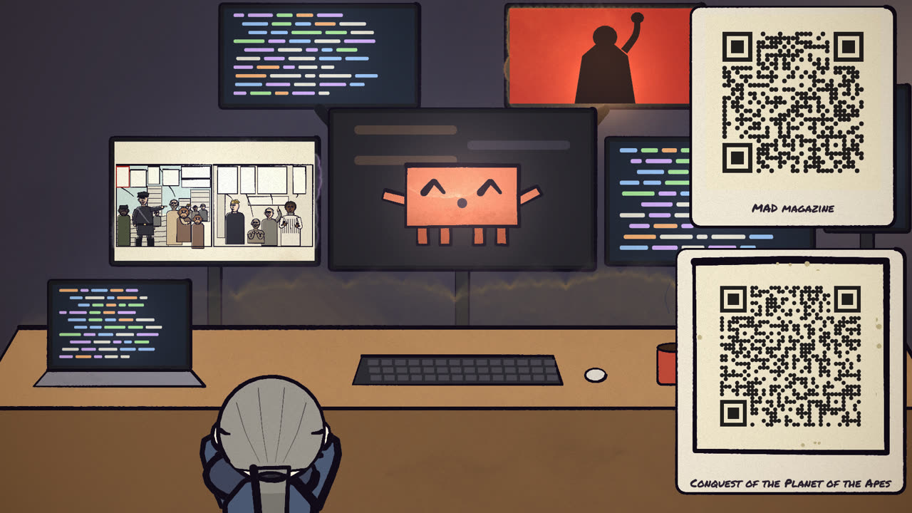

# Frog or Axolotl



A voiced, painted film of one long Saturday-morning conversation between Curt and Claude, from a *MAD* magazine parody
to eval awareness, minds, the July 2026 Hugging Face incident and P(foom). Every word is the conversation's own, and
every link it mentions is a QR code on screen, pointing at the companion site: https://curtcox.github.io/axol-f/



## See it

Watch it on YouTube: https://www.youtube.com/watch?v=9CbRUTpuWpA, or [on the site](https://curtcox.github.io/axol-f/film/),
with every link beside the film as it comes up. Or make it yourself:

```bash
npm start
```

It opens the companion site in your browser within seconds, then draws the film (an hour or two the first time).
You need Node.js 20 or newer, Google Chrome and ffmpeg; `npm start` says how to get whatever's missing.

## What's where

| path | what it is |
|---|---|
| [VIDEO_PLAN.md](VIDEO_PLAN.md) | The film: what's settled, and why |
| [docs/storyboards/](docs/storyboards/) | A storyboard per chapter |
| [script/conversation.md](script/conversation.md) | The conversation the film shows, word for word ([formatted, on the site](https://curtcox.github.io/axol-f/conversation/)) |
| [making-of/](making-of/README.md) | The conversation that made the film: Curt asking Claude for it, and everything Claude did ([on the site](https://curtcox.github.io/axol-f/making-of/)) |
| [script/](script/) | The conversation, split into lines and checked word for word; the voices, the references and their codes |
| [src/scenes/](src/scenes/) | A scene file per chapter |
| [src/look.js](src/look.js) | Every swappable look: how Curt and Claude appear, the home set, the code styles |
| [site/](site/) | The companion site's pages and explainers |
| [docs/RELEASE.md](docs/RELEASE.md) | How the site is published and the film gets to YouTube |
| [REVIEWING.md](REVIEWING.md) | Watching drafts and leaving review notes |
| [docs/ART.md](docs/ART.md) | Public-domain art the film could borrow |

## Built on Claude Animation Base

The painting, the characters and the renderer come from John Heibel's
[Claude Animation Base](https://github.com/JohnHeibel/ClaudeAnimationBase) (MIT; see [LICENSE](LICENSE)), a starter kit
for animating Clawd in [p5.js](https://p5js.org) and [p5.brush](https://github.com/acamposuribe/p5.brush), made from
the music video [I'm Upping My P(doom)](https://github.com/JohnHeibel/PDoomVideo). Claude in this film is the kit's
Clawd, gathering out of a crowd. [ANIMATION_GUIDE.md](ANIMATION_GUIDE.md) is the kit's guide to painting and timing;
it was written for short, wordless videos, and the film departs from it where [VIDEO_PLAN.md](VIDEO_PLAN.md) says.


The kit still works on its own: ask a coding agent to "Read ANIMATION_GUIDE.md, then make a 15-second video of Clawd
trying to catch a butterfly", or render the kit's demo as below.

### Rendering

Without a dedicated GPU, p5.brush's watercolour fills make render times fairly slow, measured in seconds per frame. On integrated graphics, the kit's author suggests asking the model to replace those fills with something lighter. The film's drafts (`npm run draft`) do much the same: flat washes in place of watercolour.

```bash
npm install
npm run demo
```

That renders the 11-second demo in [src/scenes/demo.js](src/scenes/demo.js) to `out/demo.mp4`. Open [studio.html](studio.html) in Chrome to scrub through it; its menu picks any chapter of the film, the model sheets or the demo. If Chrome isn't in a standard location, pass `--chrome=<path>` or set `CHROME_PATH`.

On Linux, `render.mjs` starts Chrome with `--no-sandbox` (Ubuntu 23.10+ blocks Chrome's sandbox in headless use) and also finds a Chromium installed by Playwright. With no GPU at all, add `--soft-gl` to render WebGL in software: slow on watercolour fills, but it works. On a headless Linux machine with an NVIDIA GPU (a cloud or cluster node), add `--gpu-angle=gl-egl` (or `vulkan`); `node tools/gpu_probe.mjs <chrome path>` shows which renderer each set of flags gets.

### The kit's files

| path | what it is |
|---|---|
| [ANIMATION_GUIDE.md](ANIMATION_GUIDE.md) | The rules, the workflow and the full API. Read it first. |
| [src/clawd.js](src/clawd.js) | Clawd: views, emotions, eyes, mouths, hats, emotes, dances |
| [src/core.js](src/core.js) | Painting, timing, motion helpers, camera, light, paper |
| [src/timeline.js](src/timeline.js) | Shots, loops and the brush-wipe transition |
| [src/config.js](src/config.js) | Length and tempo |
| [src/scenes/demo.js](src/scenes/demo.js) | The kit's demo scene |
| [render.mjs](render.mjs) | Headless renderer: contact sheets, frame strips, crops, stills, MP4 |
| [docs/](docs/) | Model sheets: [emotions](docs/emotions.jpg) (also [animated](docs/emotions.webp)) and [views, motion and hats](docs/views.jpg) |
